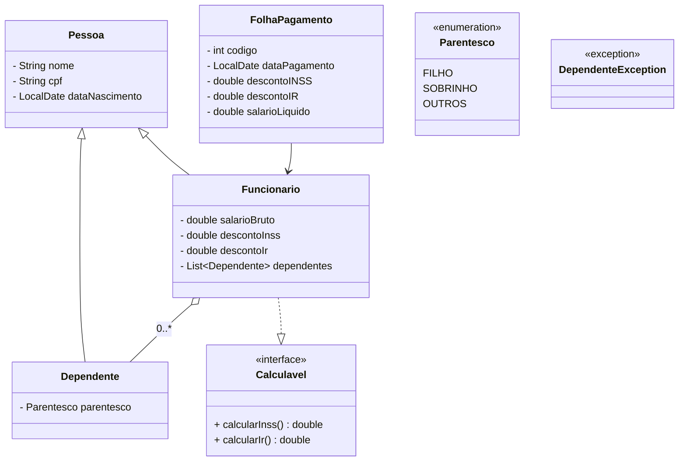
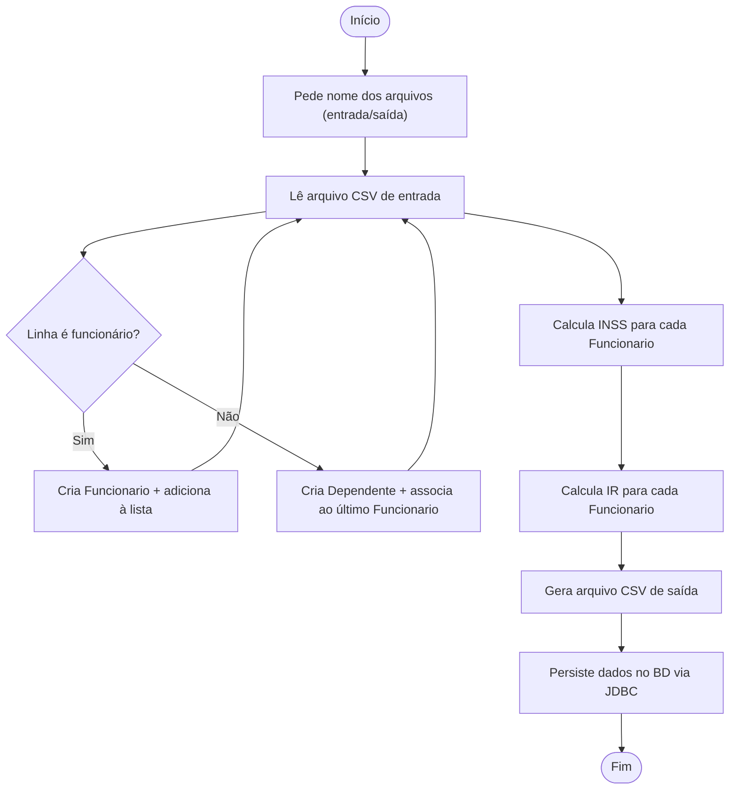
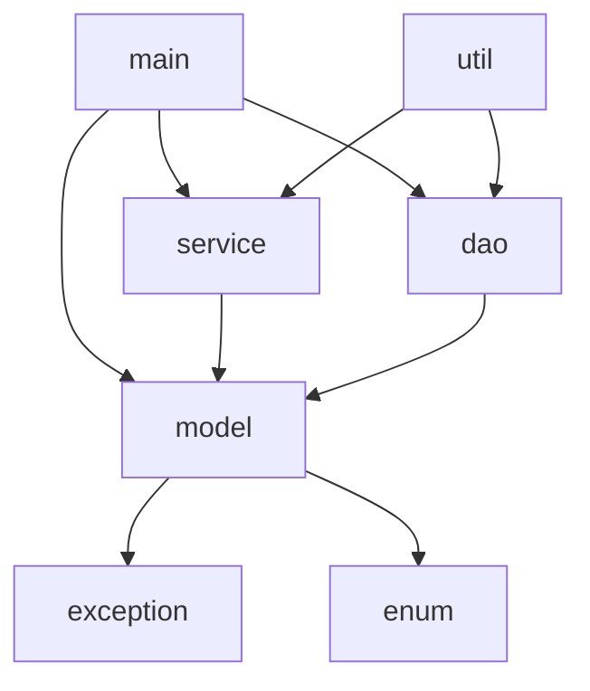

📋 Sistema de Cadastro de Funcionários — Trabalho Final de POO
> Sistema em Java para cálculo de salário líquido de funcionários, com leitura/escrita de CSV, cálculo de INSS/IR e persistência via JDBC.
---
📑 Índice
Resumo
Enunciado
Requisitos Funcionais
Requisitos Não Funcionais
Regras de Negócio
Estrutura de Pacotes e Classes
Fluxos Principais
Tabelas de INSS e IR
Formato dos Arquivos
Checklist de Entregáveis
Passo a Passo de Implementação
Casos de Teste
Fontes e Referências
---
📝 Resumo
Este projeto implementa um sistema de folha de pagamento em Java, aplicando os conceitos de Programação Orientada a Objetos. O sistema:
Lê um arquivo CSV com dados de funcionários e dependentes
Calcula descontos de INSS e Imposto de Renda (IR) conforme tabelas oficiais
Gera um arquivo CSV de saída com os resultados
Persiste os dados em banco de dados via JDBC
---
📌 Enunciado
Desenvolver um sistema em Java que calcule o salário líquido de funcionários de uma empresa, aplicando conceitos de POO. O programa deverá:
Ler um arquivo de entrada (CSV com `;` como delimitador) contendo dados de funcionários e seus dependentes. Cada funcionário terá: nome, CPF, data de nascimento e salário bruto, seguido de zero ou mais linhas de dependentes (nome, CPF, data de nascimento e parentesco).
Criar objetos representando cada `Pessoa` (abstrata), `Funcionario` e `Dependente`. Os dependentes devem ser associados ao funcionário correto. CPF de funcionário ou dependente não pode se repetir.
Calcular para cada funcionário os descontos de INSS e IR conforme as tabelas oficiais, considerando dedução fixa por dependente. Determinar o salário líquido (`salário bruto − descontos`).
Gerar um arquivo de saída (CSV) contendo: nome, CPF, desconto de INSS, desconto de IR e salário líquido de cada funcionário.
Persistir os dados no banco de dados via JDBC: funcionários, dependentes e cálculos de folha. CPF repetido deve gerar exceção e impedir inserção duplicada.
Seguir padrões de POO: classes abstratas e concretas, encapsulamento, herança, `enum` para parentesco, interface para cálculos, exceções personalizadas, coleções (`HashSet`, `ArrayList`), pacotes organizados e `LocalDate` para datas.
Incluir diagrama de classes (UML) e garantir que o programa execute conforme especificado.
---
✅ Requisitos Funcionais
#	Requisito
1	Leitura de CSV de entrada: solicitar nome do arquivo e lê-lo linha a linha (delimitador `;`). Validar presença e formato dos campos.
2	Criação de objetos `Pessoa`: instanciar `Funcionario` e `Dependente`, associando dependentes ao funcionário atual.
3	Cálculo de INSS: cálculo progressivo conforme tabela oficial. Armazenar em `descontoInss`.
4	Cálculo de IR: base = `salarioBruto − INSS − (R$ 189,59 × nº dependentes)`. Aplicar tabela progressiva de IRPF. Armazenar em `descontoIr`.
5	Geração de CSV de saída: arquivo com colunas `Nome; CPF; DescontoINSS; DescontoIR; SalarioLiquido`, valores com duas casas decimais.
6	Persistência via JDBC: criar tabelas `funcionario`, `dependente`, `folha_pagamento`. Inserir dados e validar duplicidade de CPF.
7	Interface de console: solicitar nomes de arquivos via `Scanner`. Exibir mensagens de erro adequadas.
8	Documentação/UML: entregar diagrama de classes e estrutura de pacotes junto ao código.
---
⚙️ Requisitos Não Funcionais
Validação de dados: campos obrigatórios validados antes de criar objetos. CPF com 11 dígitos numéricos, data no formato `YYYYMMDD`, salário > 0. Lançar `IllegalArgumentException` em caso de dados inválidos.
Formato CSV: usar `;` como delimitador. Linhas sem cabeçalho e sem espaços extras.
Persistência: conexão JDBC configurável (URL, usuário, senha). O sistema deve criar as tabelas se não existirem. Conectar somente após validar os dados.
Compatibilidade: Java 11 ou superior (LTS). Usar `java.time.LocalDate` para datas.
Performance mínima: processar centenas de funcionários sem travar. Usar `HashSet` para CPFs únicos e `PreparedStatement` para consultas.
Mensagens claras: erros comunicados via exceções ou mensagens no console.
Organização: estrutura Maven/Gradle ou pacotes separados. Incluir `README` com instruções de compilação e execução.
---
📏 Regras de Negócio Obrigatórias
Regra	Descrição
CPF único	Não pode haver dois funcionários ou dependentes com mesmo CPF. Usar `HashSet<String>` para validar. Duplicidade lança `IllegalArgumentException`.
Dependente < 18 anos	Todo dependente deve ter idade < 18 anos na data atual (`Period.between(...).getYears() < 18`). Se ≥ 18 anos, lança `DependenteException` e o descarta.
Contador estático	Manter `static int contadorFuncionarios` em `Funcionario`, incrementado no construtor após validações.
Uso de exceções	Erros tratados via exceções (`IllegalArgumentException`, `DependenteException`), não apenas `System.out.println`.
Dedução por dependente	Cada dependente reduz R$ 189,59 da base de cálculo do IR.
INSS progressivo	Alíquotas aplicadas faixa a faixa (7,5% a 14%), conforme tabela oficial.
Parentesco via enum	O campo parentesco deve corresponder a um valor do enum `Parentesco` (`FILHO`, `SOBRINHO`, `OUTROS`). Valor inválido lança erro.
Formatos rígidos	CPF: 11 dígitos; data: `YYYYMMDD`; salário: decimal com ponto (2 casas). Formato errado causa exceção de parsing.
CPF único no BD	Antes de inserir, verificar duplicidade via `SELECT`. Em caso positivo, lançar exceção e abortar inserção.
---
🗂️ Estrutura de Pacotes e Classes
```
src/
├── main/
│   └── Main.java               # Orquestra a aplicação
├── model/
│   ├── Pessoa.java             # Classe abstrata
│   ├── Funcionario.java        # Herda de Pessoa, implementa Calculavel
│   ├── Dependente.java         # Herda de Pessoa
│   ├── FolhaPagamento.java     # Registro de folha
│   └── Parentesco.java         # Enum: FILHO, SOBRINHO, OUTROS
├── service/
│   └── Calculavel.java         # Interface com calcularInss() e calcularIr()
├── dao/
│   ├── FuncionarioDAO.java
│   ├── DependenteDAO.java
│   └── FolhaPagamentoDAO.java
├── exception/
│   └── DependenteException.java
└── util/
    └── CsvUtils.java           # Leitura/escrita de CSV, validações auxiliares
```
Responsabilidades por pacote
Pacote	Responsabilidade
`model`	Classes de domínio: `Pessoa`, `Funcionario`, `Dependente`, `FolhaPagamento`, `Parentesco`
`service`	Lógica de cálculo e interface `Calculavel` (`calcularInss()`, `calcularIr()`)
`dao`	Acesso ao banco via JDBC: inserção e consulta de funcionários, dependentes e folhas
`exception`	Exceções customizadas: `DependenteException`
`util`	Utilitários: leitura/escrita de CSV, conversões, validações
`main`	Ponto de entrada, interação com o usuário via console
Classes e atributos principais
`Pessoa` (abstract)
```
- nome: String
- cpf: String
- dataNascimento: LocalDate
+ getters, toString()
```
`Funcionario` (extends Pessoa, implements Calculavel)
```
- salarioBruto: double
- descontoInss: double
- descontoIr: double
- dependentes: List<Dependente>
- static contadorFuncionarios: int
+ adicionarDependente(), calcularInss(), calcularIr(), getters/setters
```
`Dependente` (extends Pessoa)
```
- parentesco: Parentesco
+ getters
```
`FolhaPagamento`
```
- codigo: int
- funcionario: Funcionario
- dataPagamento: LocalDate
- descontoINSS: double
- descontoIR: double
- salarioLiquido: double
+ getters, toString()
```
`Calculavel` (interface)
```
+ calcularInss(): double
+ calcularIr(): double
```
`DependenteException` (extends RuntimeException)
```
+ DependenteException(String mensagem)
```
Diagrama de Classes (UML)

---
🔄 Fluxos Principais do Sistema
Fluxograma Geral

Estrutura de Dependências dos Pacotes

Leitura do CSV
Solicitar nome do arquivo via `Scanner`
Abrir `BufferedReader` e ler linha a linha, dividindo por `;`
Se linha é de funcionário: instanciar `Funcionario`, verificar CPF no `HashSet` global
Se linha é de dependente: instanciar `Dependente`, validar idade < 18 e CPF único, vincular ao último funcionário lido
Ao final, retornar `List<Funcionario>` com todos os dados
Persistência via JDBC
Criar tabelas se não existirem (`funcionario`, `dependente`, `folha_pagamento`)
Para cada `Funcionario`: executar `INSERT` e obter ID gerado
Para cada `Dependente`: executar `INSERT` referenciando `id_funcionario`
Para cada `Funcionario`: criar `FolhaPagamento` com data atual e inserir na tabela
Em caso de CPF duplicado: capturar `SQLException` e informar no console
---
📊 Tabelas de Cálculo
Tabela de INSS (Progressiva — 2023)
Faixa Salarial (R$)	Alíquota
Até 1.302,00	7,5%

De 1.302,01 a 2.571,29	9,0%
De 2.571,30 a 3.856,94	12,0%
De 3.856,95 a 7.507,49	14,0%
> O cálculo é **progressivo**: cada faixa é aplicada apenas sobre a parcela do salário que se enquadra nela.
Tabela de IRPF Mensal (Jan–Abr/2025)
Base de Cálculo (R$)	Alíquota	Parcela a Deduzir (R$)
Até 2.259,20	Isento	—
De 2.259,21 a 2.826,65	7,5%	169,44
De 2.826,66 a 3.751,05	15,0%	381,44
De 3.751,06 a 4.664,68	22,5%	662,77
Acima de 4.664,68	27,5%	896,00
> **Fórmula IR:** `IR = (base × alíquota) − parcela_a_deduzir`  
> **Base de cálculo IR:** `salarioBruto − descontoINSS − (189,59 × númeroDependentes)`  
> **Salário líquido:** `salarioBruto − descontoINSS − descontoIR`
---
📁 Formato dos Arquivos
CSV de Entrada
Delimitador: `;`
Sem cabeçalho
Bloco por funcionário: primeira linha é o funcionário, linhas seguintes são seus dependentes
Formato linha de funcionário:
```
FUNCIONARIO;Nome Completo;CPF(11 dígitos);DataNascimento(YYYYMMDD);SalarioBruto
```
Formato linha de dependente:
```
DEPENDENTE;Nome Completo;CPF(11 dígitos);DataNascimento(YYYYMMDD);Parentesco
```
Exemplo:
```
FUNCIONARIO;Maria Silva;12345678901;19900515;4000.00
DEPENDENTE;João Silva;98765432100;20150310;FILHO
DEPENDENTE;Ana Silva;11122233344;20180820;FILHO
FUNCIONARIO;Carlos Souza;55566677788;19851120;2000.00
```
CSV de Saída
Formato:
```
Nome;CPF;DescontoINSS;DescontoIR;SalarioLiquido
```
Exemplo:
```
Maria Silva;12345678901;250.45;123.30;3626.25
Carlos Souza;55566677788;150.00;0.00;1850.00
```
Campo	Formato
Nome do funcionário	Texto (espaços permitidos)
CPF	11 dígitos numéricos
DescontoINSS	Decimal com 2 casas (ex.: `250.45`)
DescontoIR	Decimal com 2 casas
SalarioLiquido	Decimal com 2 casas
Tabelas do Banco de Dados
```sql
CREATE TABLE IF NOT EXISTS funcionario (
    id INT AUTO_INCREMENT PRIMARY KEY,
    nome VARCHAR(100) NOT NULL,
    cpf VARCHAR(11) UNIQUE NOT NULL,
    data_nascimento DATE NOT NULL,
    salario_bruto DOUBLE NOT NULL
);

CREATE TABLE IF NOT EXISTS dependente (
    id INT AUTO_INCREMENT PRIMARY KEY,
    nome VARCHAR(100) NOT NULL,
    cpf VARCHAR(11) UNIQUE NOT NULL,
    data_nascimento DATE NOT NULL,
    parentesco VARCHAR(20) NOT NULL,
    id_funcionario INT,
    FOREIGN KEY (id_funcionario) REFERENCES funcionario(id)
);

CREATE TABLE IF NOT EXISTS folha_pagamento (
    id INT AUTO_INCREMENT PRIMARY KEY,
    id_funcionario INT,
    data_pagamento DATE NOT NULL,
    desconto_inss DOUBLE NOT NULL,
    desconto_ir DOUBLE NOT NULL,
    salario_liquido DOUBLE NOT NULL,
    FOREIGN KEY (id_funcionario) REFERENCES funcionario(id)
);
```
---
✔️ Checklist de Entregáveis
Entregável / Critério	Verificação
✅ Leitura e escrita de CSV	CSV de entrada lido corretamente; saída no formato especificado
✅ Cálculos corretos de INSS/IR	Valores calculados conforme tabelas oficiais
✅ Regra: CPF único	CPF duplicado rejeitado com exceção (leitura e BD)
✅ Regra: dependente < 18 anos	Dependente ≥ 18 anos lança `DependenteException`
✅ Modelagem OO	Classes abstrata/concretas, pacotes separados, UML entregue
✅ Interface e exceções	Uso de `Calculavel` e `DependenteException`
✅ Persistência JDBC	Tabelas criadas, dados inseridos corretamente
✅ Controle de versão (Git)	Branch criada no GitHub conforme instruções
✅ Documentação	README com instruções, diagrama de classes, comentários
✅ Execução e desempenho	Programa executa sem erros nos casos de teste
Critérios de pontuação (baseados no enunciado original)
30 pontos — Conteúdo e funcionamento (cálculos e fluxos)
15 pontos — Uso de recursos de POO (herança, encapsulamento, exceções, enum, etc.)
15 pontos — Uso de Git (branch e entrega no GitHub)
Demais pontos — Documentação, organização de pacotes, tratamento de erros
---
🛠️ Passo a Passo de Implementação
Etapa 1 — Modelagem inicial
Criar pacote `model`. Implementar `Pessoa` (abstrata), `Funcionario`, `Dependente` com atributos mínimos e validações no construtor (`IllegalArgumentException` se inválido). Criar enum `Parentesco` e interface `Calculavel`. Criar `DependenteException` no pacote `exception`.
Etapa 2 — Fluxo de leitura CSV
Criar pacote `util`. Escrever método `lerCSV` com `BufferedReader`. Interpretar linhas (funcionário ou dependente) e instanciar objetos. Manter `List<Funcionario>` e `HashSet<String>` de CPFs para validar unicidade. Testar com arquivos de exemplo.
Etapa 3 — Cálculos de INSS/IR
No `service` (ou diretamente em `Funcionario`), implementar INSS progressivo faixa a faixa e IR usando fórmula `(base × alíquota) − dedução`. Validar manualmente com casos conhecidos.
Etapa 4 — Geração de CSV de saída
Criar método em `util` ou `service`. Abrir `BufferedWriter` com o nome fornecido. Para cada funcionário, escrever linha formatada com `String.format` (2 casas decimais, com `Locale.US` para ponto decimal). Fechar o stream.
Etapa 5 — Persistência via JDBC
Configurar conexão JDBC. No pacote `dao`, criar `FuncionarioDAO`, `DependenteDAO`, `FolhaPagamentoDAO`, cada um com método `save` executando `INSERT`. Criar/verificar tabelas SQL. Tratar `SQLException` para CPF duplicado.
Etapa 6 — Integração e testes
Integrar tudo no `Main`: ler CSV → calcular → escrever CSV → inserir no BD. Fazer testes manuais com 1–2 funcionários e casos complexos. Refinar tratamento de erros com `try/catch`.
Etapa 7 — Documentação e revisão
Escrever `README` com instruções. Gerar diagrama UML. Checar organização em pacotes. Comitar no Git na branch exigida.
---
🧪 Sugestões de Testes e Casos de Borda
Caso de Teste	Comportamento Esperado
Funcionário sem dependentes	Cálculo correto de IR sem dedução de dependentes
Funcionário com vários dependentes (1, 2, 5)	Dedução de R$ 189,59 por dependente na base do IR
Salários nos limites das faixas (ex.: R$ 1.302,00; R$ 4.664,68)	Cálculo correto nas bordas das tabelas INSS/IR
CSV mal formatado (campos errados, CPF com letras, data inválida)	Lança `IllegalArgumentException` ou similar
CPF duplicado em funcionário ou dependente	Exceção impedindo criação de objeto duplicado
Dependente maior de idade (≥ 18 anos)	Lança `DependenteException`, dependente descartado
Arquivo de entrada inexistente	Mensagem de erro de arquivo não encontrado
BD inacessível ou credenciais erradas	Aviso de erro de conexão JDBC
Grande volume (centenas de funcionários)	Execução sem travamento (uso de `BufferedReader` e `PreparedStatement`)
---
📚 Fontes e Referências
Fonte	Link
Tabela INSS 2023 — Portaria Interministerial nº 26	gov.br/previdencia
Tabelas IRPF 2025 — Receita Federal	gov.br/receitafederal
Comma-Separated Values (CSV) — RFC 4180	Wikipedia PT
`IllegalArgumentException` — Java Docs	Oracle Java Docs
FAQ JDBC — Oracle	oracle.com/br
`LocalDate` — Java SE 11 Docs	Oracle Java SE 11
---
🚀 Como Compilar e Executar
> **Pré-requisitos:** Java 11+, Maven (ou Gradle), banco de dados MySQL/PostgreSQL em execução.
Compilar
```bash
mvn clean compile
```
Executar
```bash
mvn exec:java -Dexec.mainClass="main.Main"
```
Ao executar, o programa solicitará via console:
```
Informe o nome do arquivo de entrada (CSV): entrada.csv
Informe o nome do arquivo de saída (CSV): saida.csv
```
Configurar conexão com o banco
Edite o arquivo de configuração JDBC (ex.: `src/util/ConexaoDB.java`) com suas credenciais:
```java
private static final String URL    = "jdbc:mysql://localhost:3306/folha_pagamento";
private static final String USUARIO = "seu_usuario";
private static final String SENHA   = "sua_senha";
```
---
Trabalho Final — Programação Orientada a Objetos | Residência em Java
